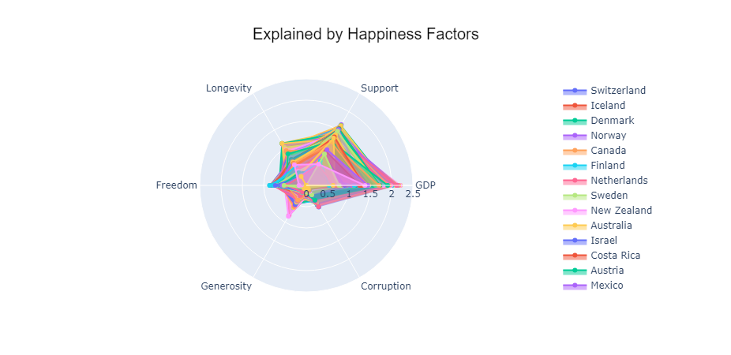

# SIADS 521 Assignment 3 - Data Visualization Dashboard

> Submission by velen@umich.edu

## Table of Contents
* [General Info](#general-information)
* [Technologies Used](#technologies-used)
* [Features](#features)
* [Screenshots](#screenshots)
* [Setup](#setup)
* [Usage](#usage)
* [Project Status](#project-status)
* [To Do](#to-do)
* [Acknowledgements](#acknowledgements)
* [Contact](#contact)

## General Information
- The Jupyter Notebook file, assignement3.jpynb is the exploratory data analysis for World Happiness Report dataset.
- The source data were downloaded from Kaggle.
- The assignment3.html file is the HTML output, which can serve as step-by-step tutorial for reproduction of the analysis. 
- Please note some Interactive Ploty plots were not rendered in the HTML output. As a workaround the Jupyter Notebook file has added references to the static images of the plots in `assets` folder.

## Technologies Used
- Python
- Jupyter Notebook
- Pandas
- Plotly, Plotly Express
- Matplotlib
- Seaborn
- Scikit-learn
- Git
- Optional: VS Code, Jupyter Notebook Viewer

## Screenshots for the Fundamental Exploratory Data Analysis


## Screenshots for the Interactive Dashboard



## Setup
Assuming you have Python 3.x and Jupyter Notebook installed, you can run the notebook locally.
1. Clone the repository:
   ```bash
   git clone https://github.com/9owlsboston/what_makes_us_happy.git
   ```
2. Navigate to the project directory:
   ```bash
   cd what_makes_us_happy
   ```

## Usage
1. Open the Jupyter Notebook:
   ```bash
   jupyter notebook assignment3.ipynb
   ```
or
   ```bash
   code assignment3.ipynb
   ```  

# Project Status
Project is _completed_.
Latest Version: 1.0.0


## To Do
- There are empty output for the interactive dashboard plots when export the Jupyter Notebook to HTML
  - Tried added Add more interactive plots to the dashboard

## Acknowledgements
- Many thanks to the awesome instructors and metors of SIADS521:
  @Anthony Giove
  @Deepti Wilson
  @Erik Lang
  @Pat Steffes
  @Ramiro Serrano Vergel
  @Ryan Maley
and professor @Christopher Brooks 
for their guidance and support throughout the course. 

- Kaggle authors for the World Happiness Report datasets:
  - [World Happiness Report](https://www.kaggle.com/datasets/unsdsn/world-happiness)
  - [World Happiness Report 2015-2023](https://www.kaggle.com/datasets/fqayyum73/world-happiness-report-2015-2023)
  - [World Happiness Report 2024](https://www.kaggle.com/datasets/ajaypalsinghlo/world-happiness-report-2024)
  
## Contact
- [Velen](velen@umich.edu)
- [LinkedIn](https://www.linkedin.com/in/velenliang)